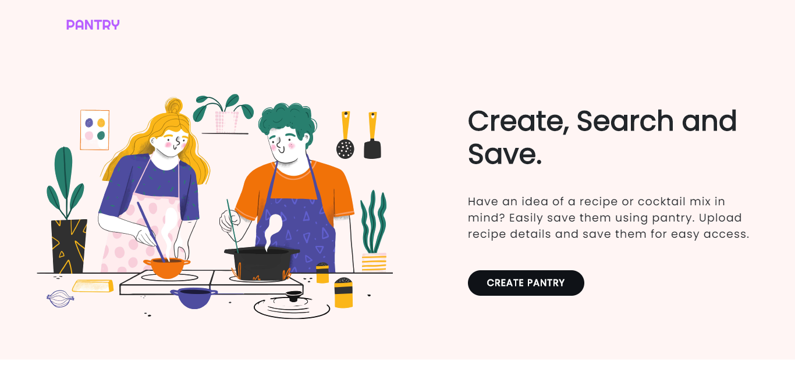
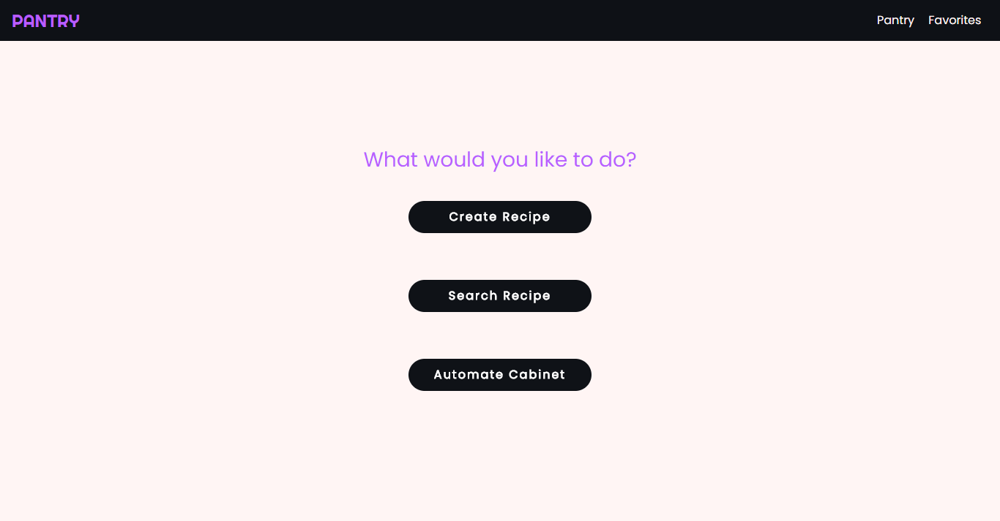

# Pantry: Recipe App

A recipe app that enables users create, search and save their favorite recipes.

## Technologies

* React
* Sass
* React Bootstrap
* Firebase
---

### Pantry Landing page



### Pantry Home Page


---

## Project Setup

* Clone repo on local machine
```
$ git clone https://github.com/ijeomaemeruwa/pantry.git
```

* Move to project directory
```
$ cd pantry
```

* Install React Dependencies
```
$ npm install
```

* Start development server
```
$ npm start
```
---

## Image Attribution

[Food Vector by Freepik](https://www.freepik.com/vectors/food)


