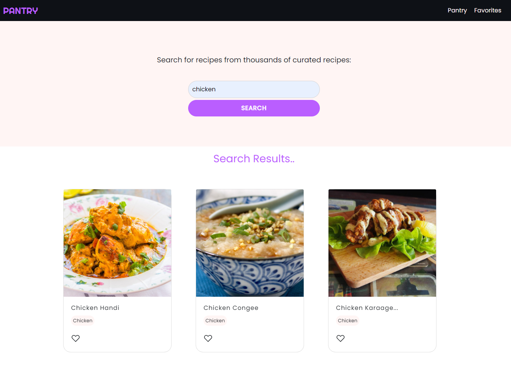
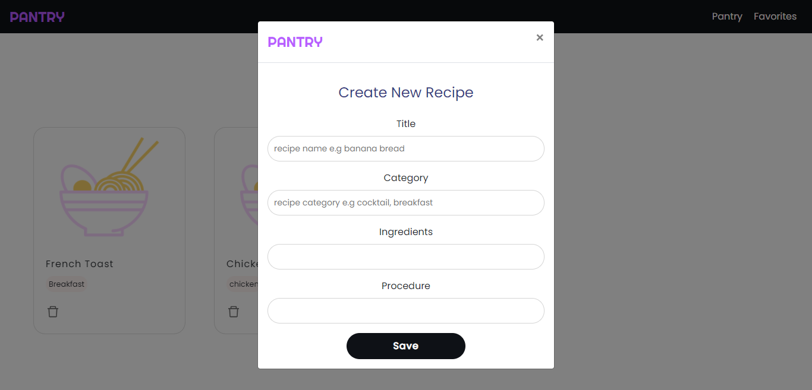
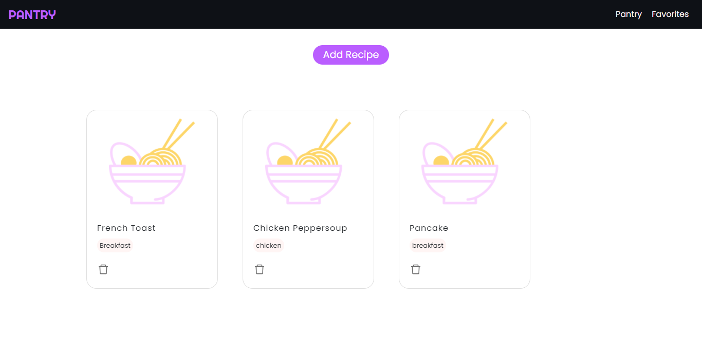

# Pantry: Recipe App

A recipe app that enables users create, search and save their favorite recipes.

## Technologies

* React
* Sass
* React Bootstrap
* Firebase
---

### Pantry Landing page
User can click on the "Create Pantry" button to move to the home page.


### Pantry Home Page
* Note: Automate cabinet is still in development.


### Pantry Search Recipe Page
This page enables users search for recipes online with the help of an API [TheMealDB API](https://www.themealdb.com/). User can also click on a recipe to view more details of that recipe.




### Pantry Create Recipe Form
This form enables users create a custom recipe on the click of the "Add Button", which is then added to the pantry page via the firebase firestore.



### Pantry Page
Stores information about each recipe created by the user.



---

## Project Setup

* Clone repo on local machine
```
$ git clone https://github.com/ijeomaemeruwa/pantry.git
```

* Move to project directory
```
$ cd pantry
```

* Install React Dependencies
```
$ npm install
```

* Start development server
```
$ npm start
```
---

## Image Attribution

[Food Vector by Freepik](https://www.freepik.com/vectors/food)


